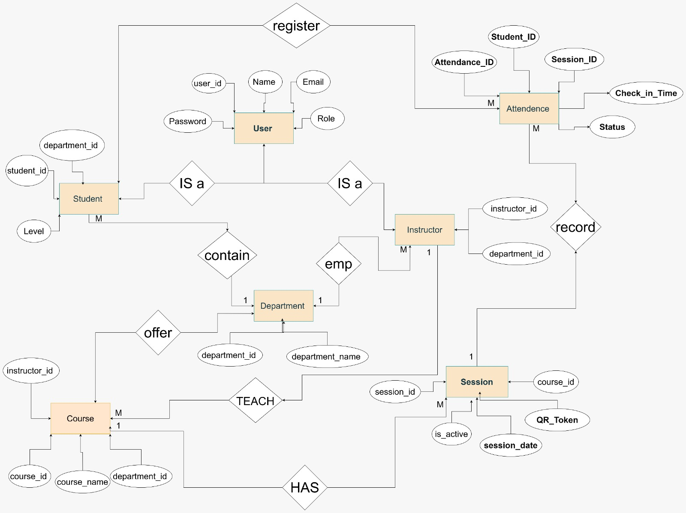

# Attendance-System-Database-Architecture
A robust database schema design for a Smart Attendance System using SQL Server, focusing on data integrity, normalization, and inheritance
# Smart Attendance System - Database Design

# Project Overview
This project showcases a professional database architecture for an attendance management system. The design emphasizes **Data Integrity** and **Scalability**.

# Key Features
*   **Inheritance Pattern:** Implemented an `IS-A` relationship between Users, Students, and Instructors.
*   **Data Integrity:** Used Foreign Key constraints and Unique indexes to prevent duplicate attendance.
*   **T-SQL Implementation:** Written in SQL Server dialect with optimized JOIN queries.

# ERD Diagram

# Technologies Used
*   SQL Server (T-SQL)
*   ERD Modeling Tools
